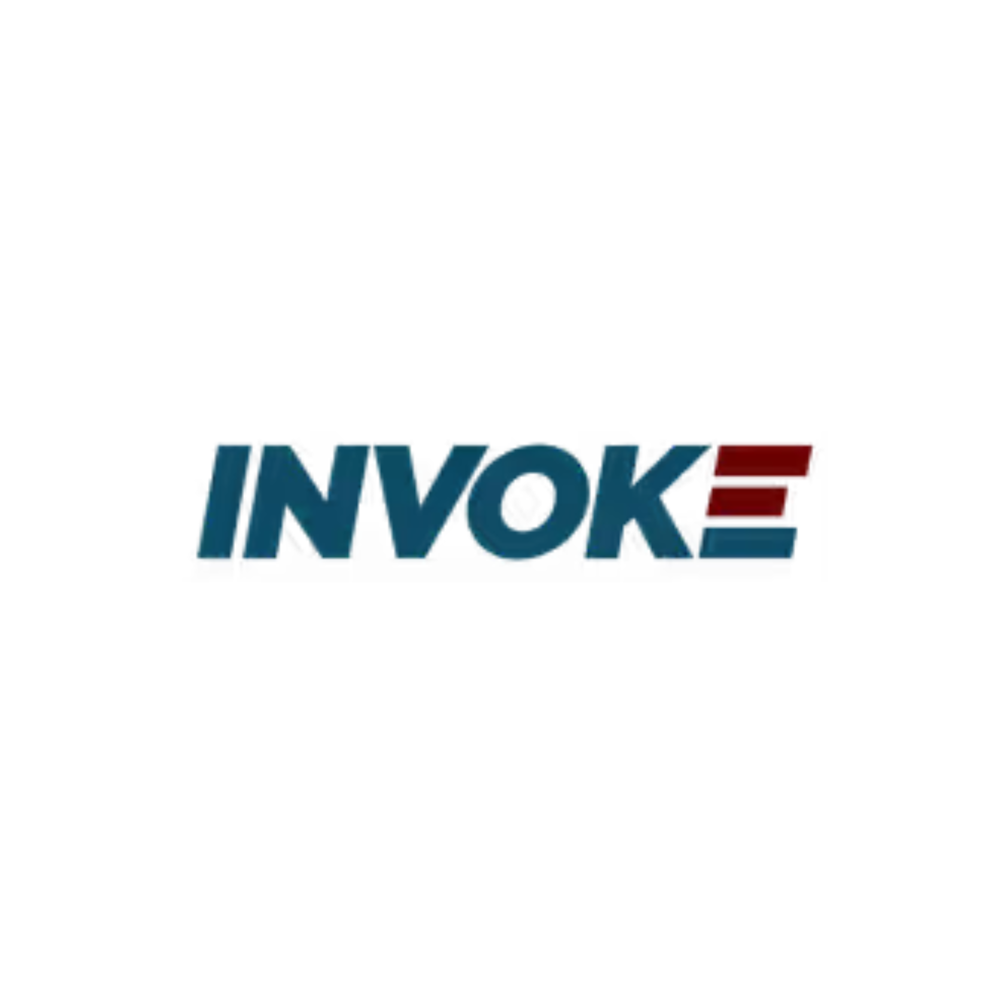
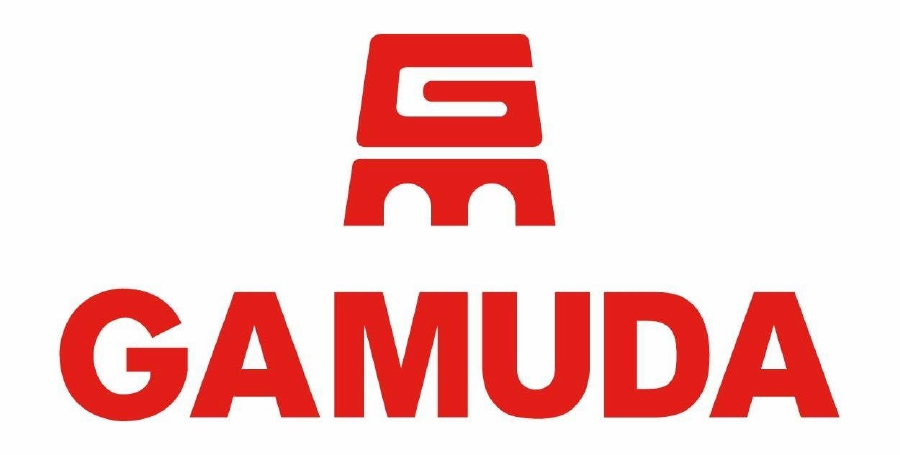
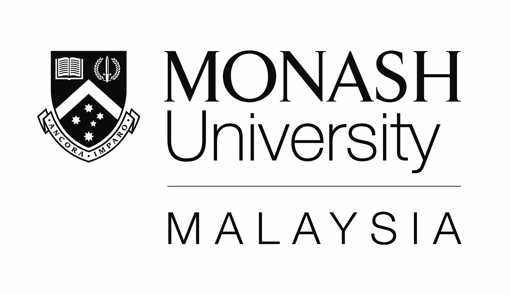
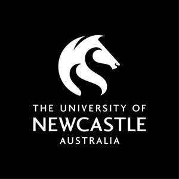
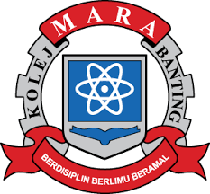
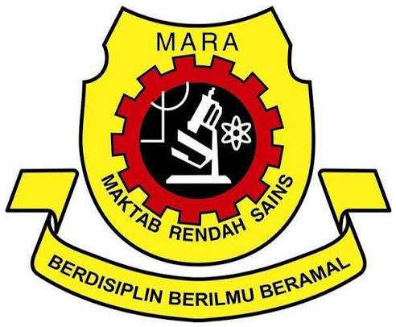

someone who loves..

Most of my professional work is proprietary. The projects in the sidebar are ones I can share, with code (where applicable).

Below is a brief timeline of my education and work experience. Further details can be found in my [resume](files/resume.pdf){download="MaryamMohamed_Resume.pdf"}. 

```{=html}
<style>
.tl { border-left: 3px solid #888; padding-left: 1rem; }
.tl details { margin-bottom: 1.2rem; }

.tl summary { display: flex; align-items: center; gap: 1rem; cursor: pointer; list-style: none; }
.tl summary::-webkit-details-marker { display: none; }
.tl summary::after { content: "▾"; margin-left: auto; color: #888; }
.tl summary::after { content: "▾"; margin-left: auto; }
.tl details[open] summary::after { content: "▴"; }

.tl summary::after,
.tl details[open] summary::after { color: #ffbd59 !important; }

.tl img {
  width: 48px;
  height: 48px;
  object-fit: contain;
  border-radius: 12px;
  background: #fff;
  padding: 4px;
}
/* for uon logo */
.tl img.logo-plain { background: none; padding: 0; object-fit: cover; }

/* closed = white, open = yellow */
.tl summary,
.tl summary span,
.tl summary b { color: #fff !important; }

.tl details[open] summary,
.tl details[open] summary span,
.tl details[open] summary b { color: #ffbd59 !important; }

.tl b { display: block; }
.tl .more { margin: 0.6rem 0 0 4rem; font-size: 0.95rem; }

a { color: #ffbd59; }
a:hover { color: #ffd48a; }
</style>

<div class="tl">

  <details open>
    <summary>
      
      <span><b>Jan. 2026 - present</b>Data Scientist, INVOKE Solutions</span>
    </summary>
    <div class="more">
      <ul>
        <li>Built Bayesian election prediction models (Dirichlet vote share simulation).</li>
        <li>Developed consumer survey instruments and analysis pipelines.</li>
        <li>Tools: R, Python, BigQuery.</li>
      </ul>
    </div>
  </details>

  <details close>
    <summary>
      
      <span><b>Sept. 2025 - Nov. 2025</b>Full-stack AI Development Bootcamp, Gamuda Learning Center</span>
    </summary>
    <div class="more">Add details here.</div>
  </details>

  <details close>
    <summary>
      
      <span><b>Jul. 2023 - Jul. 2025</b>Master of Artificial Intelligence (Coursework), Monash University Malaysia</span>
    </summary>
    <div class="more">Add details here.</div>
  </details>

  <details close>
    <summary>
      
      <span><b>Sept. 2021 - Oct. 2022</b>Language Support Assistant, Global Engagement Office, University of Newcastle</span>
    </summary>
    <div class="more">Add details here.</div>
  </details>

  <details close>
    <summary>
      
      <span><b>Feb. 2019 - Nov. 2021</b>Bachelor of Design (Architecture), University of Newcastle, Australia</span>
    </summary>
    <div class="more">Add details here.</div>
  </details>

  <details close>
    <summary>
      
      <span><b>Jun. 2016 - Jun. 2018</b>International Baccalaureate Diploma (IBDP), MARA Banting College</span>
    </summary>
    <div class="more">Add details here.</div>
  </details>

  <details close>
    <summary>
      
      <span><b>Feb. 2012 - May. 2016</b>IGCSE O-Levels, Junior MARA Science College</span>
    </summary>
    <div class="more">Add details here.</div>
  </details>

</div>
```